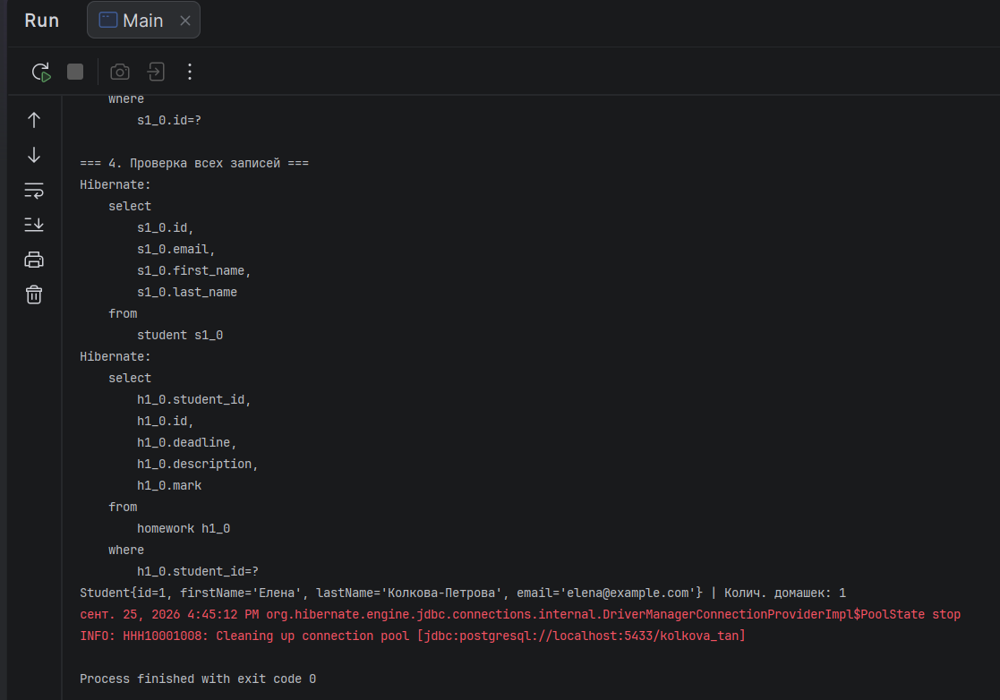
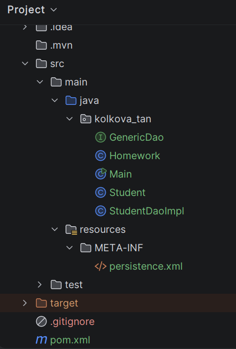

# Объектно-реляционное отображение (ORM) с использованием JPA и Hibernate

Этот проект демонстрирует настройку и использование **JPA (Jakarta Persistence API)** и **Hibernate** для работы с реляционной базой данных PostgreSQL без написания «чистого» SQL-кода.

## 🛠️ Стек технологий
* **Java** (версия 25)
* **Hibernate ORM** (версия 6.5.2.Final)
* **Jakarta Persistence API** (версия 3.1.0)
* **PostgreSQL Driver** (версия 42.7.3)
* **Maven**

## 📂 Архитектура и структура классов
Проект организован по пакетной структуре `kolkova_tan`:
* `Student.java` — Entity-класс (Сущность) с маппингом связи `@OneToMany` (Один-ко-Многим) к домашним заданиям. Реализованы синхронизированные методы `addHomework` и `removeHomework`.
* `Homework.java` — Entity-класс (Сущность) со связью `@ManyToOne` (Многие-к-Одному), указывающей на конкретного студента через внешний ключ `student_id`.
* `GenericDao.java` — Параметризованный интерфейс для CRUD операций.
* `StudentDaoImpl.java` — Реализация интерфейса на базе `EntityManager` и `EntityManagerFactory`.
* `persistence.xml` — Конфигурационный файл JPA (настройка подключения, диалекта БД и автоматического обновления схем через `hibernate.hbm2ddl.auto = update`).

---

## 📸 Подтверждение работы (Скріншоти для LMS)

### 1. Лог работы программы в IntelliJ IDEA
При запуске `Main.java` Hibernate автоматически сгенерировал таблицы в базе данных `kolkova_tan` на порту `5433` и успешно выполнил все CRUD-тесты:

### 2. Структура проекта в IDE
